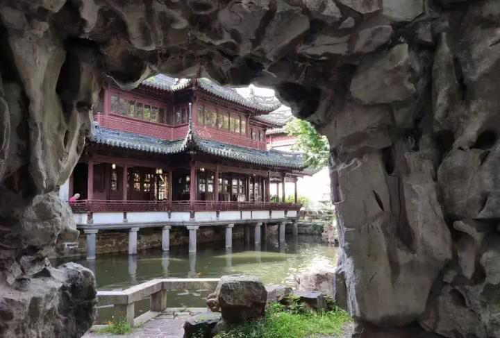

# **上海旅游日记**
上海旅游日记
2019年5月，我们一家三口来到了上海。这是我第一次来上海，也是第一次去大城市旅游。在此之前，我对上海的印象都是从电视剧和电影中看到的，比如《情深深雨蒙蒙》、《外来媳妇本地郎》、《新白娘子传奇》等等。所以当我真正来到上海时，发现它并没有想象中那么繁华，反而给人一种很亲切的感觉。

  

图片来源于网络
首先，我们来到了上海的标志性建筑——东方明珠广播电视塔。作为上海的地标性建筑，东方明珠可以说是非常值得一去的地方。登上东方明珠后，你可以俯瞰整个上海的全景，还可以看到黄浦江两岸的美景。另外，东方明珠内部也有很多好玩的项目，比如旋转餐厅、360度球幕影院等等，让你玩得不亦乐乎。

  

图片来源于网络
其次，我们来到了上海的另一个标志性建筑——上海中心大厦。上海中心大厦是目前世界第二高的摩天大楼，仅次于迪拜的哈利法塔。站在上海中心大厦的观景平台上，你可以看到整个上海的全景，同时还可以看到远处的浦东新区。另外，上海中心大厦内部也有很多好玩的项目，比如观光电梯、空中步道等等，让你玩得不亦乐乎。

  

图片来源于网络
最后，我们来到了上海的著名景点——豫园。豫园是一座古典园林，建于明朝嘉靖年间，距今已有400多年的历史。园内有很多古建筑，比如“九曲桥”、“万春亭”、“御碑亭”等等，让人仿佛穿越回了古代。另外，豫园还有很多文化活动，比如书画展、戏曲表演等等，让你感受到浓厚的文化氛围。

  

图片来源于网络
总的来说，上海是一座非常值得一去的城市，无论是自然风光还是人文景观，都会让你流连忘返。希望未来有更多的机会能够再次来到上海，感受这座城市的魅力。

  

 图片来源于网络ി</s>