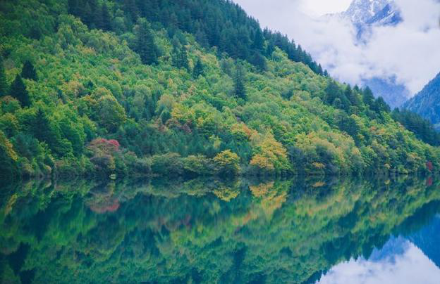
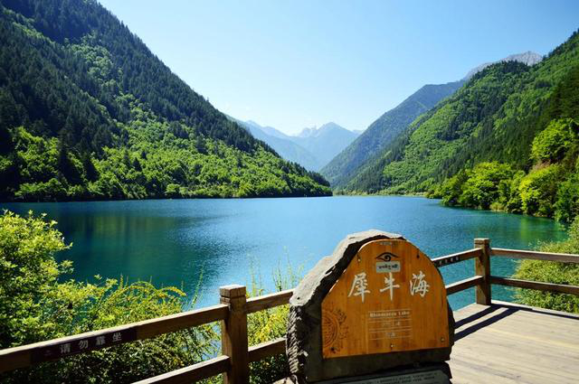
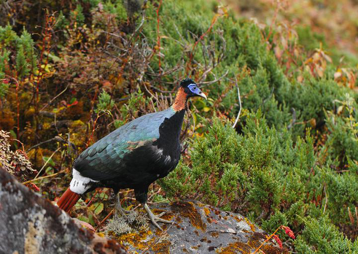
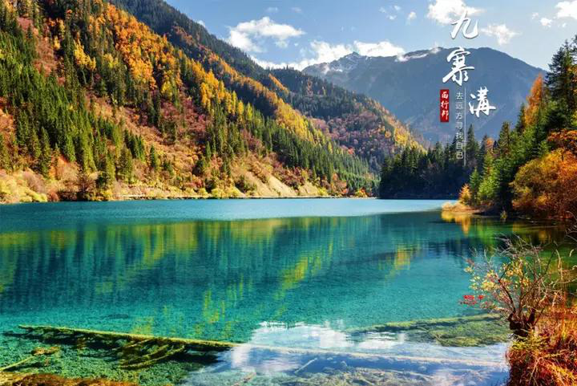
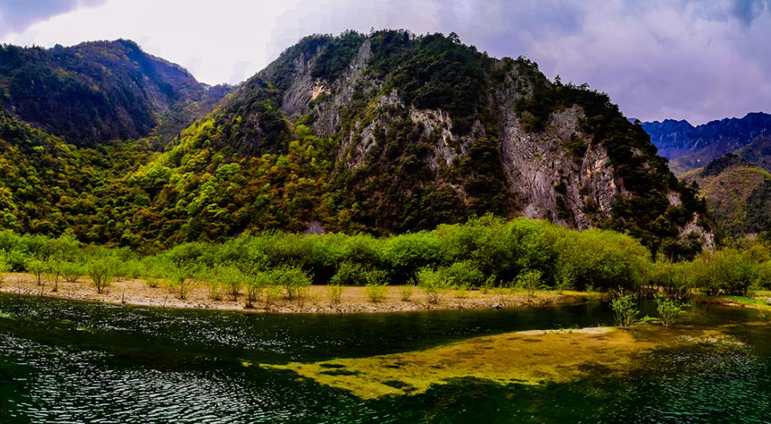
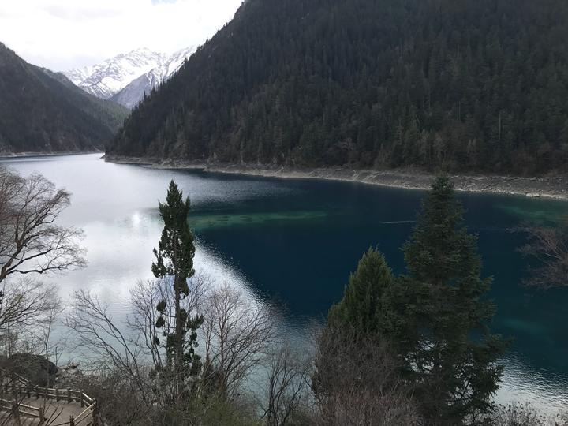

# **九寨沟旅游**
九寨沟位于四川省阿坝藏族羌族自治州九寨沟县漳扎镇境内，地处青藏高原南缘，岷山山脉中段，是一条长约100千米的山沟谷地，东西宽18千米，南北长38千米，总面积约600平方千米。
九寨沟由三大沟谷组成，即树正沟、日则沟和则查洼沟，全长42千米，平均海拔在2000米以上，最高点为5546米，最低点为1994米，垂直高度达3600多米，因沟内有树正瀑布、日则瀑布、则查洼瀑布等九个藏族传说中的“神湖”而得名。

  

 图片来源于网络
九寨沟景区主要由树正群海、五花海、火花海、熊猫海、长海、五彩池、双龙海、镜海、箭竹海、诺日朗瀑布、珍珠滩瀑布、老虎海、犀牛海、莲宝叶则等景观组成。
九寨沟森林茂密，植物种类繁多，据统计，共有野生维管束植物117科、411属、1200余种，其中国家重点保护的珍稀植物有珙桐、红豆杉、白皮松、云杉、冷杉、红杉、落叶松、油松、桦木、槭树、椴树、水曲柳、银杏、黄檗、连香树等。

  

 图片来源于网络
九寨沟动物资源也十分丰富，现已发现的有大熊猫、金丝猴、羚牛、雪豹、黑颈鹤、白唇鹿、岩羊、马麝、小熊猫、金雕、玉带海雕、雀鹰、苍鹰、松鸡、杜鹃、啄木鸟、斑头雁、天鹅、鸳鸯、鹭鸶、翠鸟、蛙类、两栖类、爬行类、鱼类、昆虫类等。

  

 图片来源于网络
九寨沟气候温和湿润，冬无严寒，夏无酷暑，四季分明，雨量充沛，日照时间短，昼夜温差大，空气湿度大，适宜动植物生长繁衍。

  

 图片来源于网络
九寨沟旅游资源丰富，文化底蕴深厚，民族风情浓郁，人文景观与自然景观融为一体，构成了一幅幅绚丽多彩的画卷。

  

 图片来源于网络
九寨沟被称为“人间仙境”，被誉为“世界第一奇观”，每年吸引着数以百万计的国内外游客前来观光旅游。

  

  图片来源于网络
如果您喜欢此篇文章，欢迎评论、收藏、转发、点赞。获得更多精彩内容，敬请关注【行行出状元】。
本文由行行出状元原创，商业转载请联系作者获得授权，非商业转载请务必标明“行行出状元原创”，侵权必究。ി</s>