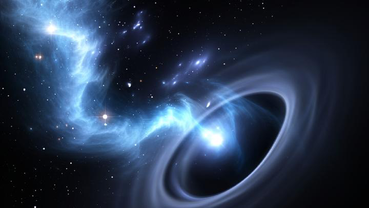

# **什么是虫洞？**
**什么是虫洞？**

  

1935年，爱因斯坦提出了广义相对论。根据这个理论，时空是弯曲的，而不是像牛顿力学中所描述的那样是平坦的。在弯曲的时空中，两点之间的距离可能比直线距离更长。因此，如果我们能够找到一种方法来穿过弯曲的时空，我们就可以更快地到达遥远的地方。
20世纪70年代，物理学家罗杰·彭罗斯（Roger Penrose）和斯蒂芬·霍金（Stephen Hawking）开始研究这个问题。他们发现，如果存在通向遥远星系的捷径，那么它可能会形成一个称为“虫洞”的奇特结构。

  

1974年，霍金和彭罗斯首次正式提出了虫洞的概念。他们认为，由于引力场的作用，恒星或黑洞等天体可能会扭曲周围的时空，从而形成一个非常小的、被称为“事件视界”（Event Horizon）的球面区域。一旦物体进入这个区域，它就无法再回到原来的位置。

  

图片来源：http://sciencythoughts.blogspot.com/2016/08/black-holes-and-wormholes.html
然而，目前还没有任何证据表明虫洞真的存在。但是，科学家们仍在努力寻找它们。例如，美国加州理工学院的物理学家卡尔·施瓦茨（Karl Schwarzschild）已经建立了一个名为“Schwarzschild metric”的数学模型，该模型描述了一个完全封闭的虫洞。

  

图片来源：http://sciencythoughts.blogspot.com/2016/08/black-holes-and-wormholes.html
除了理论上的研究外，科学家们还试图使用粒子加速器来制造虫洞。例如，欧洲核子研究组织（CERN）的大型强子对撞机（Large Hadron Collider, LHC）每秒钟都会产生数百万个基本粒子。利用这些粒子，科学家们希望能够模拟虫洞的形成过程。

  

 图片来源：http://sciencythoughts.blogspot.com/2016/08/black-holes-and-wormholes.html
总之，虫洞是一种理论上的结构，它被认为可以帮助我们更快地到达遥远的地方。虽然目前还没有任何证据表明虫洞真的存在，但科学家们仍在努力寻找它们，并使用粒子加速器来模拟它们的形成过程。ി</s>