# **地球介绍**
地球是太阳系的第三颗行星，也是太阳系中唯一一颗拥有大气层、水和生命的行星。它位于太阳系的内环，距离太阳约1.5亿公里（0.98亿英里）。它的直径约为12,742千米（7926英里），质量为5.97×10^24千克（相当于其他所有行星质量的总和）。

 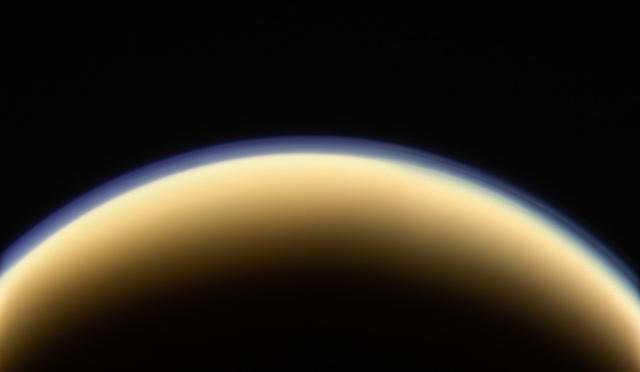 

图片来源：https://www.nasa.gov/sites/default/files/thumbnails/image/earth-from-space.jpg
地球由岩石和金属组成，主要由硅酸盐矿物组成，包括橄榄石、辉石、角闪石和长石等。这些矿物形成了地球表面的岩石类型，如花岗岩、玄武岩和安山岩。地球上最大的岩石结构是大陆板块，它们围绕地球自转并漂移在海洋之间。

 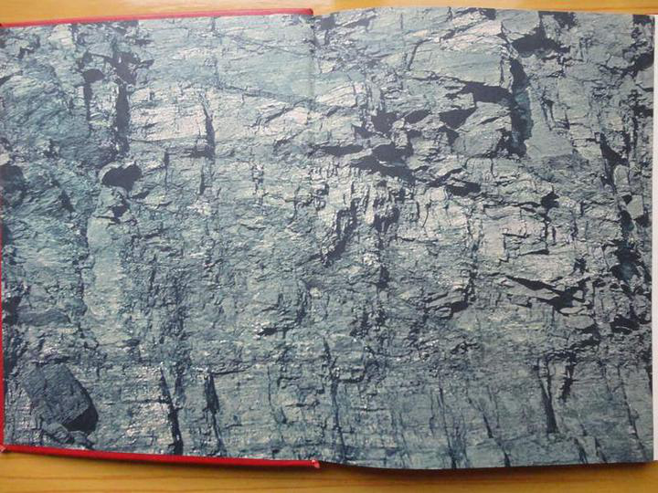 

图片来源：https://www.nasa.gov/sites/default/files/thumbnails/image/earth-atmosphere.jpg
地球的大气层非常厚，平均厚度约为30千米（19英里）。它主要由氮气、氧气、水蒸气、二氧化碳和其他气体组成。大气层可以分为两个主要部分：对流层和平流层。对流层通常高达20千米（12英里），而平流层从那里一直延伸到地球的外层空间。

 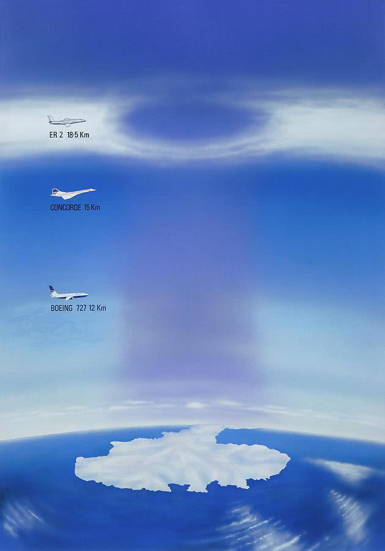 

图片来源：https://www.nasa.gov/sites/default/files/thumbnails/image/earth-magnetic-field.jpg
地球拥有一个强大的磁场，它保护地球免受来自太阳的风暴和带电粒子的影响。这个磁场起源于地球内部的液态外核，该外核与地球的固体内核相互作用。地球的磁场使我们能够看到北极光和极光。

 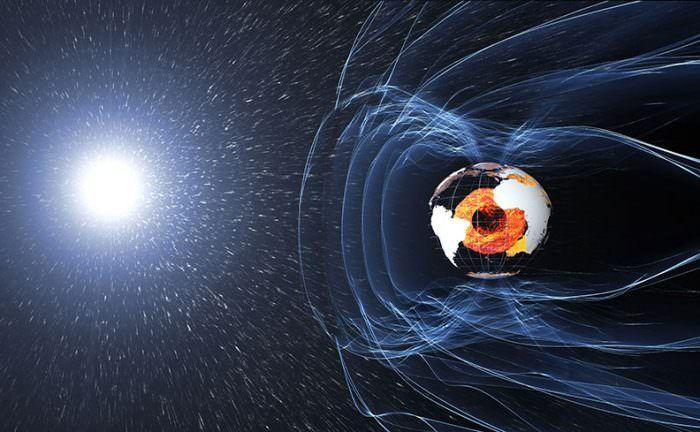 

图片来源：https://www.nasa.gov/sites/default/files/thumbnails/image/earth-moon.jpg
地球拥有一个名为月球的卫星，它是太阳系中体积最大的天然卫星。月球绕地球运行，每27.3天完成一个轨道周期。月球的平均半径约为3474千米（2160英里），比地球小得多。月球没有大气层，因此无法支持生命。

 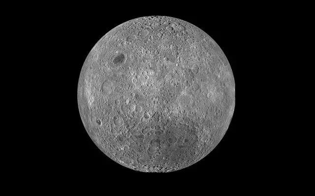 

图片来源：https://www.nasa.gov/sites/default/files/thumbnails/image/earth-ocean.jpg
地球上的水主要存在于海洋中，占地球总水量的97.5％。海洋覆盖了地球表面的71％，深度超过数千米。陆地上的水主要集中在河流、湖泊和冰川中。

 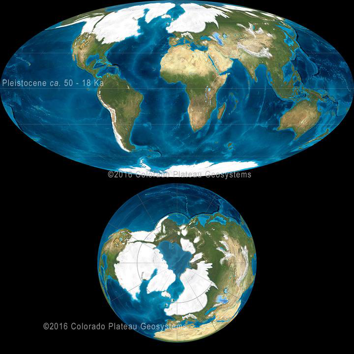 

图片来源：https://www.nasa.gov/sites/default/files/thumbnails/image/earth-climate.jpg
地球的气候受到许多因素的影响，包括太阳辐射、火山活动、温室气体排放和人类活动。气候变化可能导致极端天气事件的增加，例如干旱、洪水和飓风。

 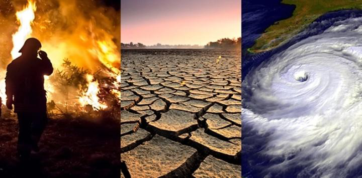 

图片来源：https://www.nasa.gov/sites/default/files/thumbnails/image/earth-volcanoes.jpg
地球上有许多活跃的火山，它们是由地球内部的热量和压力引起的。火山喷发可以产生巨大的破坏力，但也可以提供宝贵的矿产资源。

 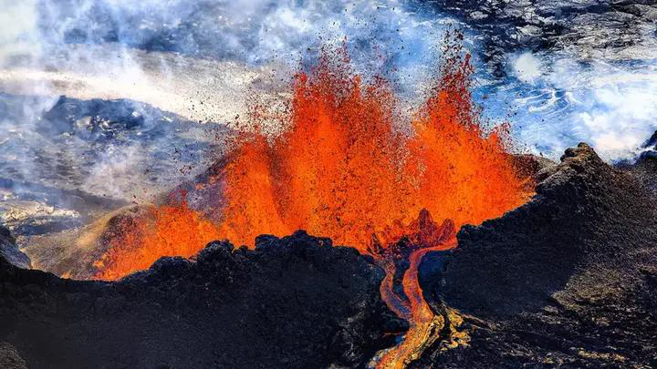 

图片来源：https://www.nasa.gov/sites/default/files/thumbnails/image/earth-evolution.jpg
地球已经存在了大约46亿年，但它仍在不断发展和改变。科学家们正在研究地球的演化历史，以帮助我们更好地理解我们居住的星球。

 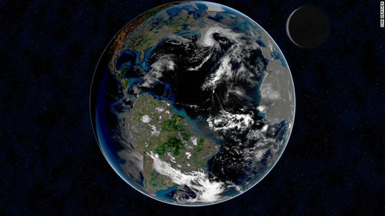 

图片来源：https://www.nasa.gov/sites/default/files/thumbnails/image/earth-ecosystems.jpg
地球上有着各种各样的生态系统，包括森林、草原、湿地和海洋。这些生态系统维持着地球上的生物多样性，并提供人类所需的食物、水和空气。

 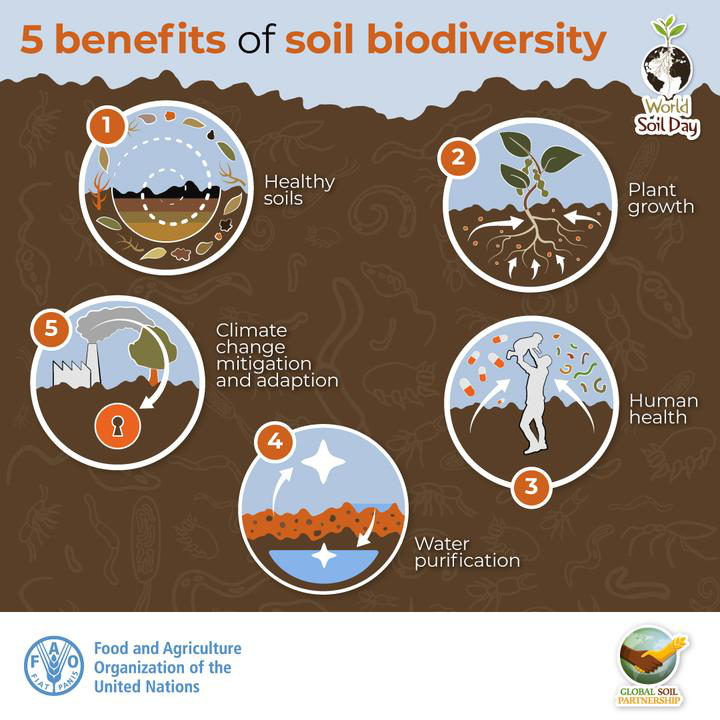 

图片来源：https://www.nasa.gov/sites/default/files/thumbnails/image/earth-human-activity.jpg
人类活动对地球产生了深远的影响，包括土地利用变化、污染和气候变化。随着人口的增长和城市化进程的加速，这些影响将继续扩大。

 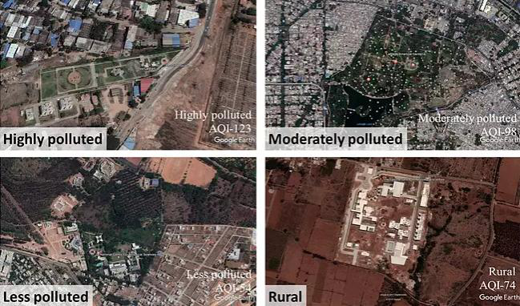 

图片来源：https://www.nasa.gov/sites/default/files/thumbnails/image/earth-global-warming.jpg
全球变暖和气候变化是地球面临的最大挑战之一。这些变化可能导致极端天气事件的增加，例如