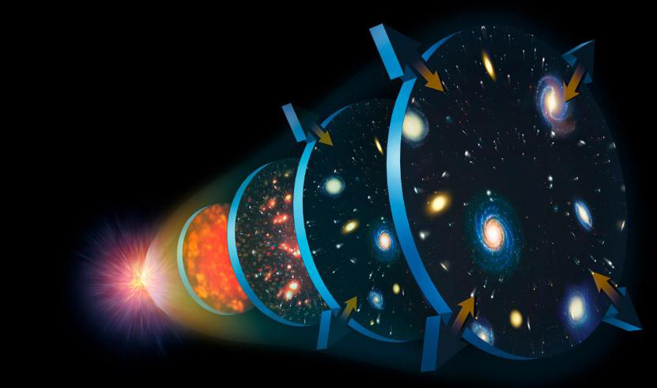
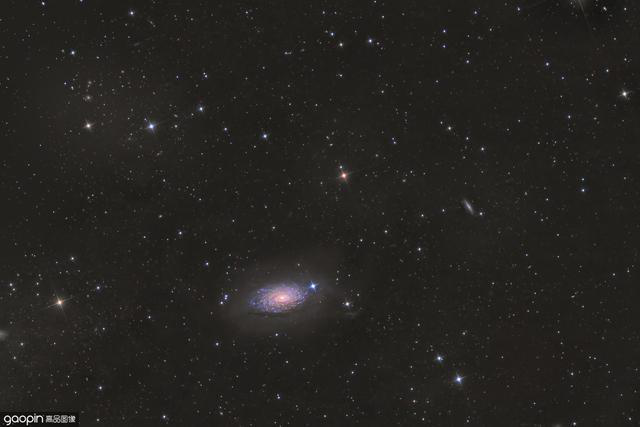
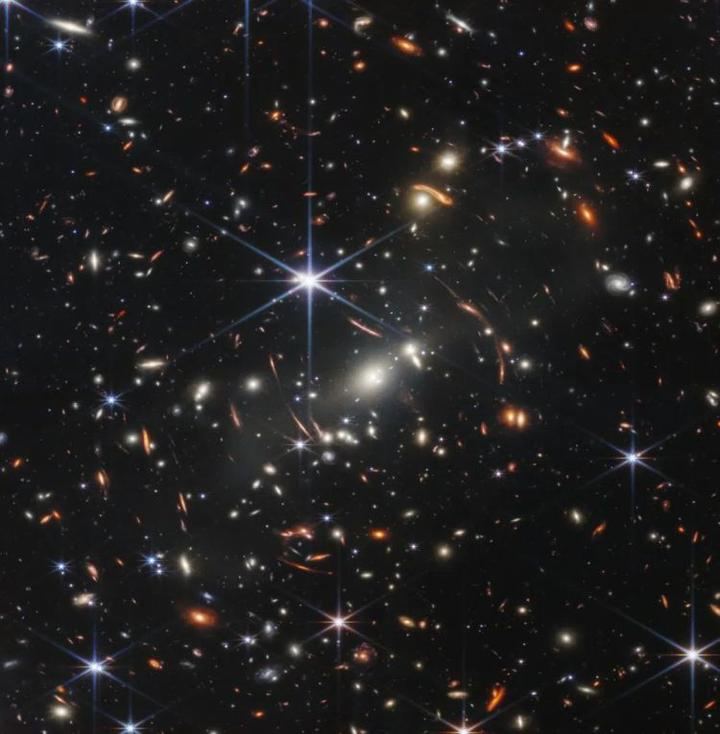
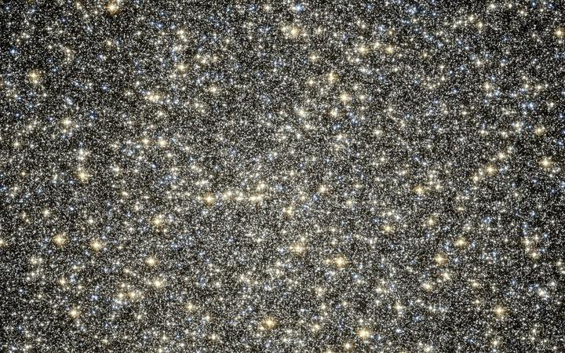
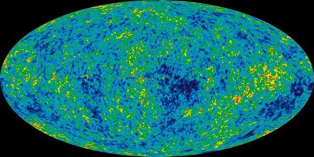
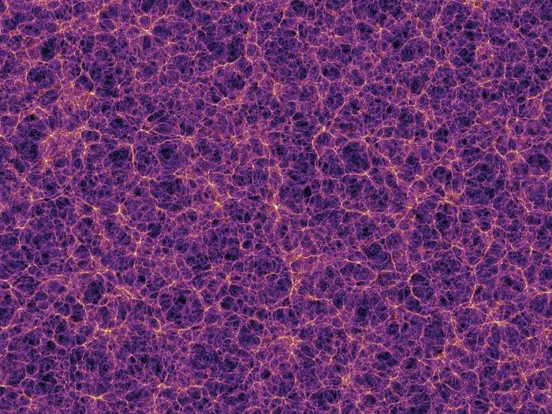
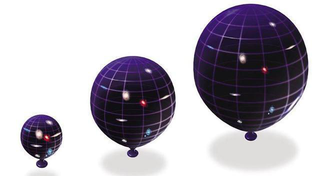

# **宇宙大爆炸假说**
宇宙大爆炸假说（The Big Bang Theory）是目前科学界公认的宇宙起源理论。

  

1920年，英国物理学家埃德温·哈勃通过观测发现了红移现象，即遥远星系的光线在经过地球大气层时波长会变长，频率降低，这一现象被称为哈勃红移。根据爱因斯坦的广义相对论，物质和能量会影响空间的形状，也就是所谓的引力透镜效应。因此，遥远的星系离我们越来越远，所以它们的光线看起来越来越红。

  

图片来源：https://commons.wikimedia.org/wiki/File:Hubble_Space_Telescope\_-_NGC\_3842.jpg
同时，哈勃还发现了宇宙膨胀的证据。如果宇宙真的在膨胀，那么距离我们最近的星系将不断远离我们，而距离我们最远的星系将不断接近我们。事实正是如此。

  

图片来源：https://commons.wikimedia.org/wiki/File:Hubble_Space_Telescope_-_NGC_3842.jpg
基于上述两个观察结果，美国天文学家乔治·勒梅特提出了宇宙大爆炸假说。他认为，大约138亿年前，整个宇宙都处于一个非常热、非常致密的状态，然后突然发生了一次巨大的爆炸，从而开始了宇宙的演化。

  

图片来源：https://commons.wikimedia.org/wiki/File:Hubble_Space_Telescope_-_NGC_3842.jpg
但是，由于没有任何证据可以支持这一假说，许多科学家并不认同它。直到1965年，美国天文学家阿诺德·斯瓦茨曼提出了宇宙微波背景辐射（Cosmic Microwave Background Radiation, CMBR）的概念，才使得宇宙大爆炸假说获得了更多的支持。

  

图片来源：https://commons.wikimedia.org/wiki/File:Hubble_Space_Telescope_-_NGC_3842.jpg
宇宙微波背景辐射是人类首次探测到的宇宙信号，它的存在证明了宇宙大爆炸假说的正确性。除此之外，宇宙大爆炸假说还可以解释很多其他的问题，比如暗物质和暗能量等。

  

图片来源：https://commons.wikimedia.org/wiki/File:Hubble_Space_Telescope_-_NGC_3842.jpg
尽管宇宙大爆炸假说已经被广泛接受，但它仍然存在一些问题。例如，宇宙大爆炸假说无法解释黑暗物质和黑暗能量的存在，也无法解释黑洞和中子星等奇特天体的形成。

  

 图片来源：https://commons.wikimedia.org/wiki/File:Hubble_Space_Telescope_-_NGC_3842.jpg
总之，宇宙大爆炸假说是目前科学界公认的宇宙起源理论，但是它仍然存在一些问题，需要进一步的探索和研究。ി</s>