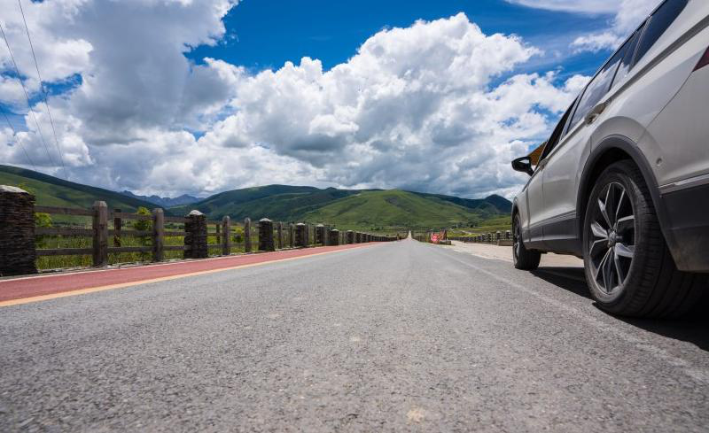
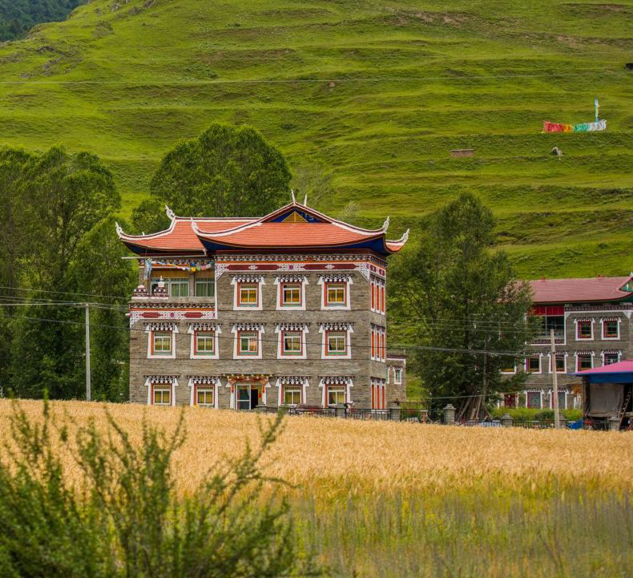
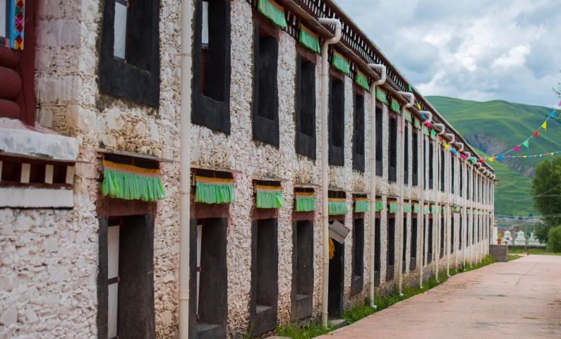
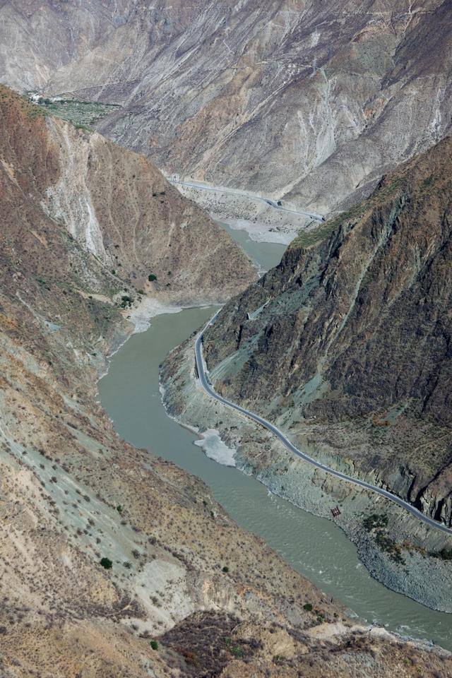
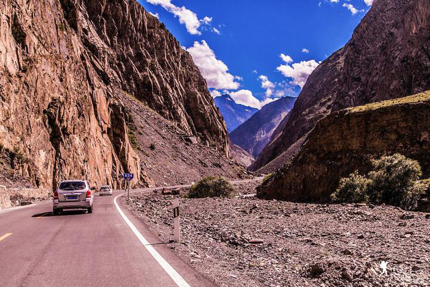
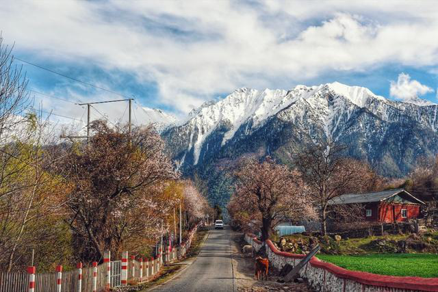
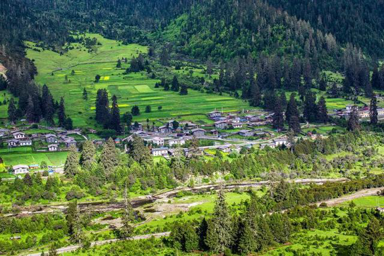
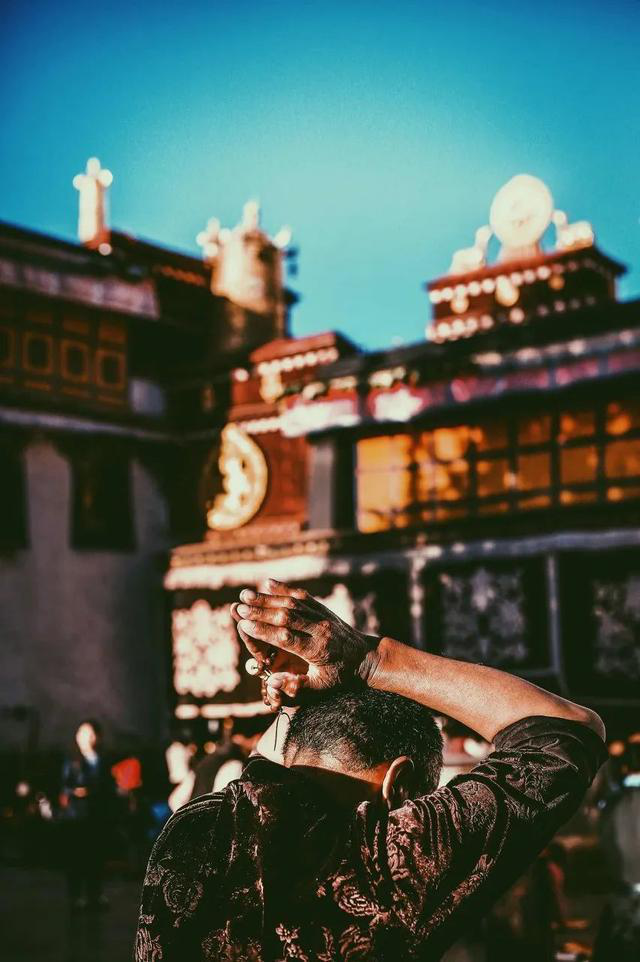

# **此生必驾318，旅程见闻**
此生必驾318，旅程见闻
2019年7月6日，我们一行四人从成都出发，开始了为期十天的川藏线之旅。

  

1. 第一天：成都-雅安-泸定-康定-新都桥（全程约450公里）
早上六点多起床，收拾好行李，七点左右出发，八点半左右到达雅安，在雅安吃了早餐，然后前往泸定，途中经过二郎山隧道，这是世界上海拔最高的公路隧道，也是中国交通建设史上的重大工程之一。下午五点左右到达康定，在康定吃了晚饭，晚上九点左右到达新都桥，入住民宿。

  

2. 第二天：新都桥-塔公草原-巴塘（全程约200公里）
今天主要目的地是塔公草原和巴塘，早上八点左右出发，大约两个小时左右到达塔公草原，塔公草原位于新都桥镇西南方向，距离新都桥镇大概三公里左右，景色非常优美，可以看到雪山、草原、河流等自然景观，还可以看到当地牧民的生活场景。游览完塔公草原后，继续往巴塘方向前进，中午左右到达巴塘，在巴塘吃了晚餐，晚上住巴塘。

  

3. 第三天：巴塘-金沙江大桥-芒康（全程约200公里）
今天主要目的地是金沙江大桥和芒康，早上八点左右出发，大约两个小时左右到达金沙江大桥，金沙江大桥是世界上海拔最高的钢桁梁悬索桥，横跨金沙江大峡谷，气势恢宏，雄伟壮观。参观完金沙江大桥后，继续往芒康方向前进，中午左右到达芒康，在芒康吃了晚餐，晚上住芒康。

  

4. 第四天：芒康-怒江大峡谷-八宿（全程约200公里）
今天主要目的地是怒江大峡谷和八宿，早上八点左右出发，大约两个小时左右到达怒江大峡谷，怒江大峡谷是世界上最深的峡谷之一，风景非常优美，可以看到悬崖峭壁、激流险滩、奇峰异石等自然景观。游览完怒江大峡谷后，继续往八宿方向前进，中午左右到达八宿，在八宿吃了晚餐，晚上住八宿。

  

5. 第五天：八宿-然乌湖-米堆冰川-波密（全程约200公里）
今天主要目的地是然乌湖、米堆冰川和波密，早上八点左右出发，大约两个小时左右到达然乌湖，然乌湖是喜马拉雅山北麓最大的湖泊之一，湖水碧绿清澈，周围群山环绕，景色非常优美。游览完然乌湖后，继续往波密方向前进，中午左右到达波密，在波密吃了晚餐，晚上住波密。

  

6. 第六天：波密-鲁朗林海-八一镇（全程约200公里）
今天主要目的地是鲁朗林海和八一镇，早上八点左右出发，大约两个小时左右到达鲁朗林海，鲁朗林海是青藏高原东南部的一片原始森林，树木参天，郁郁葱葱，空气清新，景色非常优美。游览完鲁朗林海后，继续往八一镇方向前进，中午左右到达八一镇，在八一镇吃了晚餐，晚上住八一镇。

  

7. 第七天：八一镇-拉萨（全程约200公里）
今天主要目的地是布达拉宫和大昭寺，早上八点左右出发，大约两个小时左右到达布达拉宫，布达拉宫是西藏政治、经济、文化和宗教中心的象征，被誉为“世界屋脊明珠”。游览完布达拉宫后，继续往大昭寺方向前进，中午左右到达大昭寺，大昭寺是西藏佛教格鲁派（黄教）的代表性寺庙，也是西藏现存最大、最完整的古代佛殿建筑，具有极高的历史、艺术和科学价值。游览完大昭寺后，继续往拉萨方向前进，傍晚左右到达拉萨，在拉萨吃了晚餐，晚上住拉萨。

  

8. 第八天：拉萨-羊卓雍错-拉萨（全程约200公里）
今天主要目的地是羊卓雍错和拉萨，早上八点左右出发，大约两个小时左右到达羊卓雍错，羊卓雍错是西